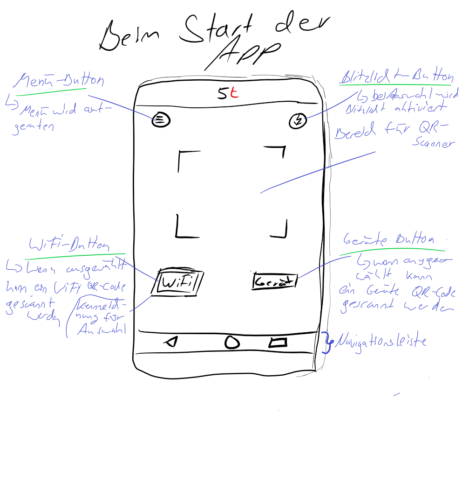

# Einführung

*Dieser Entwurf legt die prinzipielle Lösungsstruktur fest und enthält alles, was man benötigt, um einem Außenstehenden den prinzipiellen Aufbau der App erklären zu können.* (**keep it simple**)

**TODO:** Beschreibung des grundlegenden Aufbaus.

**TODO:** Verweis auf Standards wie zum Beispiel verwendete Entwurfsmuster o.ä.

# Komponentendiagramm

**TODO:** Komponentendiagramm der eigenen und externen Komponenten der App erstellen.

## Komponente 1

**TODO:** Beschreibung der Komponente inklusive seiner verwendeten und bereitgestellten Schnittstellen

## Komponente 2

**TODO:** Beschreibung der Komponente inklusive seiner verwendeten und bereitgestellten Schnittstellen

## Externe Komponente 1

**TODO:** Beschreibung der **externen** Komponente/Bibliothek und wie diese verwendet werden soll.

# Klassendiagramm

*Klassendiagramm 1.0*
## Beschreibung der wichtigen Klassenhierarchie 1
Die wichtigsten Klassen sind Startbildschrim, Scan, Menü, Optionen, AbragenMenü, AbfragenSchema, GeräteListe und die Geräte.

- Im *Startbildschrim* findet sich die *Scan* Klasse und das *Menü*. 
- Im *Menü* ist die *Optionen* Klasse, das *AbfrageMenü* und die *GeräteListe* vorzufinden.
- Im *AbfrageMenü* findet man die *AbfragenSchema* Klasse vor.
- In der *GeräteList* befindet sich die *Geräte* Klasse.

Die Klassen werden in das *Model-View-Controller* 
Prinzip eingefügt.

## 1° Startbildschirm
Im Startbildschirm ist der QR-Code Scanner, sofort geöffnet. Zudem ist das Menü auswählbar.

## 2° Scan
Durch die *Scan* Klasse kann man das Blitzlicht aktivieren. Außerdem ist es möglich einen QR-Code zu scannen (WLAN/GERÄT).

## 3° Menü
Über die *Menü* Klasse sind die Untermenüs *AbfragenMenü*, *GeräteListe*, *Optionen* auswählbar. Auch kann man sich hier manuell in eine WLAN-Netz anmelden oder Hilfe erhalten.

## 4° AbfragenMenü
Von hieraus ist die *AbfragenSchema* Klasse auswählbar. Hier können Abfragemasken hinzugefügt, bearbeitet oder gelöscht werden.

## 5 AbfragenSchema
Über die OID Strings entscheidet die Klasse welche Informationen des Geräts abgerufen werden.

## 6° GeräteListe
Hier kann man die eingescannte Geräte einsehen und auf die *Geräte* Klasse zugreifen.

## 7° Geräte
Diese Klasse dient dazu den Zustand der Geräte zu erhalten.

## 8° Optionen
Hier sind verschiedene Einstellungen möglich wie z.B. die Farb - & Sprachauswahl.

# GUI-Skizze

GUI-Skizze von Arton Kastrati, Baran Demir, Samuel Gigliotti