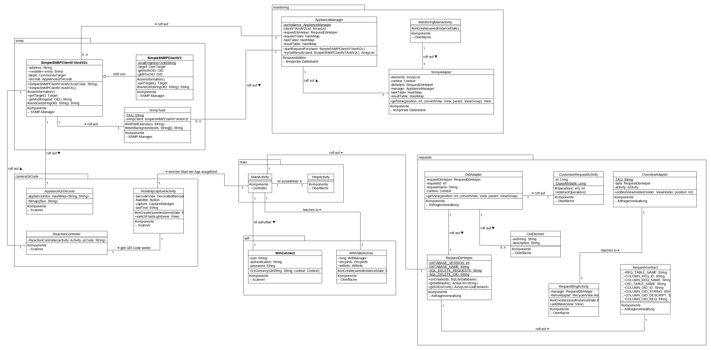
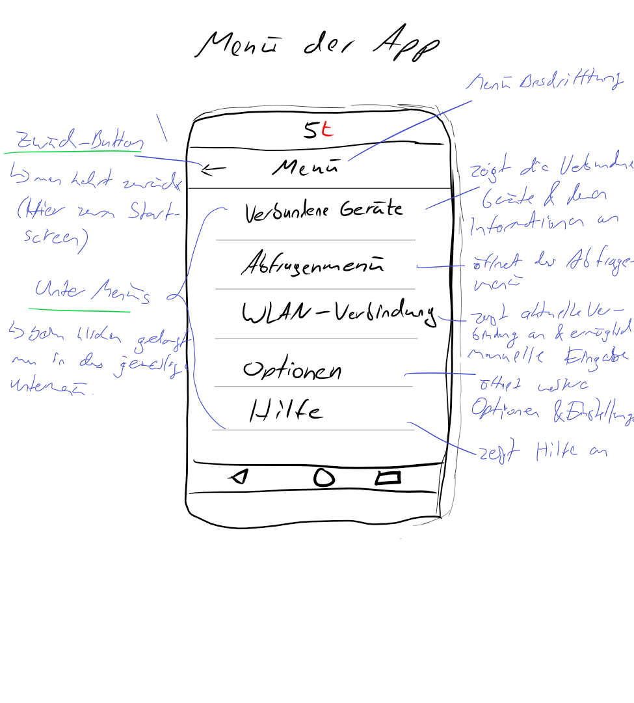

# Einführung

Dieser Entwurf legt die prinzipielle Lösungsstruktur fest und enthält alles, was man benötigt, um einem Außenstehenden den prinzipiellen Aufbau der App erklären zu können. Hier wird das Gesamtsystem in überschaubare Einheiten gegliedert und diese können potenziell in zukünftigen Projekten wiederverwendet werden.

Es wird versucht das Model-View-Controller Prinzip als Vorbild für den Aufbau umzusetzen.

Es wurden folgende Entwurfsmuster genutzt:
- Singelton: Eine Instanz für bestimmte Klassen.
- Observer: Ein Subjekt wird von Beobachtern abboniert und benachrichtigt bei Änderung die Beobachter.

# Komponentendiagramm

*Komponentendiagramm 2.0*

## Komponente 1: Controller
Der Controller ist die Komponente, die die Benutzereingaben auswertet und die Komponenten aktiviert oder benachrichtigt, die für die Ausführung der gewünschten Aktivität benötigt werden. Dafür werden Schnittstellen zu fast allen anderen Komponenten benötigt.

## Komponente 2: Abfrageneinstellungen
Diese Komponente ist dafür zuständig, Abfrageschemata zu verwalten. Dazu gehören neue Abfrageschemata zu erstellen, zu löschen und zu bearbeiten. Diese können dann verwendert werden, um bei Geräteverbindung nur bestimmte Daten zu erhalten.

## Komponente 3: Scanner
Diese Komponente ist dafür zuständig, mit Hilfe der Handykamera QR-Codes von WLAN oder Geräten im Rechenzentrum zu lesen und die entschlüsselten Daten weiterzuleiten. Diese Komponente ist essentiell um Verbindungen herzustellen und neue Geräte zu vebinden.

## Komponente 4: SNMP-Manager:
Der SNMP-Manager ist dafür zuständig, über SNMP die Abfragen von den verbundenen Geräten zu starten und periodisch die Daten zu aktualisieren. Die zurückgegebenen Daten werden über eine Schnittstelle an die temporäre Datenbank geleitet.

## Komponente 5: temporäre Datenbank
Diese Komponente ist dazu da, die in der aktuellen Sitzung erstellten Verbindungen zu speichern und bei bestimmten Abfragen weiterzuleiten. Die Datenbank hat Schnittstellen zum SNMP-Manager und zur Oberfläche.

## Komponente 6: Oberfläche
Diese Komponente bietet die Schnittstelle zum Benutzer. Sie versucht für den Benutzer die Daten und Informationen aus der Datenbank übersichtlich darzustellen und Benutzereingaben an den Controller weiter zu geben.

## Externe Komponente 1

**TODO:** Beschreibung der **externen** Komponente/Bibliothek und wie diese verwendet werden soll.

# Klassendiagramm

*Klassendiagramm 1.0*
## Beschreibung der wichtigen Klassenhierarchie 1
Die wichtigsten Klassen sind Startbildschrim, Scan, Menü, Optionen, AbragenMenü, AbfragenSchema, GeräteListe und die Geräte.

- Im *Startbildschrim* findet sich die *Scan* Klasse und das *Menü*. 
- Im *Menü* ist die *Optionen* Klasse, das *AbfrageMenü* und die *GeräteListe* vorzufinden.
- Im *AbfrageMenü* findet man die *AbfragenSchema* Klasse vor.
- In der *GeräteList* befindet sich die *Geräte* Klasse.

Die Klassen werden in das *Model-View-Controller* 
Prinzip eingefügt.

## 1° Startbildschirm
Im Startbildschirm ist der QR-Code Scanner, sofort geöffnet. Zudem ist das Menü auswählbar.

## 2° Scan
Durch die *Scan* Klasse kann man das Blitzlicht aktivieren. Außerdem ist es möglich einen QR-Code zu scannen (WLAN/GERÄT).

## 3° Menü
Über die *Menü* Klasse sind die Untermenüs *AbfragenMenü*, *GeräteListe*, *Optionen* auswählbar. Auch kann man sich hier manuell in eine WLAN-Netz anmelden oder Hilfe erhalten.

## 4° AbfragenMenü
Von hieraus ist die *AbfragenSchema* Klasse auswählbar. Hier können Abfragemasken hinzugefügt, bearbeitet oder gelöscht werden.

## 5 AbfragenSchema
Über die OID Strings entscheidet die Klasse welche Informationen des Geräts abgerufen werden.

## 6° GeräteListe
Hier kann man die eingescannte Geräte einsehen und auf die *Geräte* Klasse zugreifen.

## 7° Geräte
Diese Klasse dient dazu den Zustand der Geräte zu erhalten.

## 8° Optionen
Hier sind verschiedene Einstellungen möglich wie z.B. die Farb - & Sprachauswahl.

# GUI-Skizze

GUI-Skizze von Arton Kastrati, Baran Demir, Samuel Gigliotti